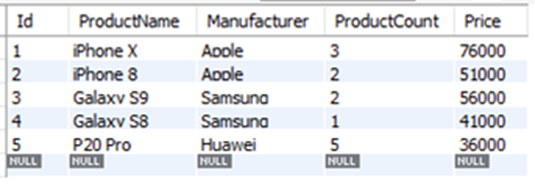
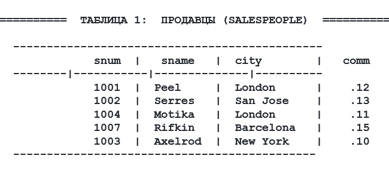
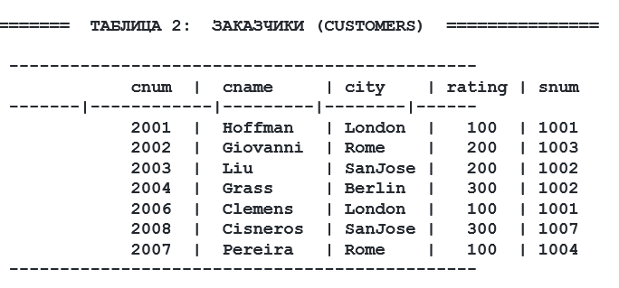

# GB_DatabasesAndSQL_2023

## Базы данных и SQL (семинары)
## Урок 1. Установка СУБД, подключение к БД, просмотр и создание таблиц

### Задание 1
Создайте таблицу с мобильными телефонами, используя графический интерфейс. 
Заполните БД данными. Добавьте скриншот на платформу в качестве ответа на ДЗ

### Задание 2
Выведите название, производителя и цену для товаров, количество которых 
превышает 2 (SQL - файл, скриншот, либо сам код)

### Задание 3
Выведите весь ассортимент товаров марки “Samsung”

### Задание 4
С помощью регулярных выражений найти:
* Товары, в которых есть упоминание "Iphone"
* "Samsung"
* Товары, в которых есть ЦИФРЫ
*  Товары, в которых есть ЦИФРА "8"

## Базы данных и SQL (семинары)
## Урок 2. SQL – создание объектов, простые запросы выборки

### Задание 1
Используя операторы языка SQL, создайте табличку “sales”. Заполните ее данными

### Задание 2
Разделите  значения поля “bucket” на 3 сегмента: меньше 100(“Маленький заказ”), 
100-300(“Средний заказ”) и больше 300 (“Большой заказ”)

### Задание 3
Создайте таблицу “orders”, заполните ее значениями. Покажите “полный” статус 
заказа, используя оператор CASE

### Задание 4
Чем NULL отличается от 0?

## Базы данных и SQL (семинары)
## Урок 3. SQL – выборка данных, сортировка, агрегатные функции

1. Напишите запрос, который вывел бы таблицу со столбцами в следующем порядке: 
city, sname, snum, comm. (к первой или второй таблице, используя SELECT)
2. Напишите команду SELECT, которая вывела бы оценку(rating), сопровождаемую 
именем каждого заказчика в городе San Jose. (“заказчики”)
3. Напишите запрос, который вывел бы значения snum всех продавцов из таблицы 
аказов без каких бы то ни было повторений. (уникальные значения в  “snum“ 
Продавцы”)
4. Напишите запрос, который бы выбирал заказчиков, чьи имена начинаются с буквы 
G. Используется оператор "LIKE": (“заказчики”) 
(https://dev.mysql.com/doc/refman/8.0/en/string-comparison-functions.html)
5. Напишите запрос, который может дать вам все заказы со значениями суммы выше 
чем $1,000. (“Заказы”, “amt”  - сумма)
6. Напишите запрос который выбрал бы наименьшую сумму заказа. (Из поля “amt” - 
сумма в таблице “Заказы” выбрать наименьшее значение)
7. Напишите запрос к таблице “Заказчики”, который может показать всех 
заказчиков, у которых рейтинг больше 100 и они находятся не в Риме.

1. Отсортируйте поле “зарплата” в порядке убывания и возрастания
2. Отсортируйте по возрастанию поле “Зарплата” и выведите 5 строк с наибольшей 
заработной платой (возможен подзапрос)
3. Выполните группировку всех сотрудников по специальности , суммарная зарплата 
которых превышает 100000.

## Базы данных и SQL (семинары)
## Урок 4. SQL – работа с несколькими таблицами

(https://drive.google.com/file/d/1PQn576YVakvlWrIgIjSP9YEf5id4cqYs/view?usp=sharing)

### Задание 1
1. Вывести на экран сколько машин каждого цвета для машин марок BMW и LADA

### Задание 2
1. Вывести на экран марку авто и количество AUTO не этой марки

### Задание 3
1. Даны 2 таблицы, созданные следующим образом:

create table test_a (id number, data varchar2(1));

create table test_b (id number);

insert into test_a(id, data) values

(10, 'A'),

(20, 'A'),

(30, 'F'),

(40, 'D'),

(50, 'C');

insert into test_b(id) values

(10),

(30),

(50);

Напишите запрос, который вернет строки из таблицы test_a, id которых нет в 
таблице test_b, НЕ используя ключевого слова NOT.

